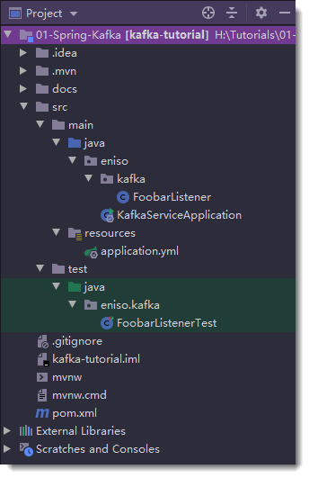
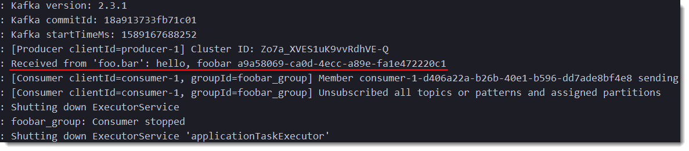
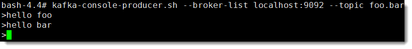
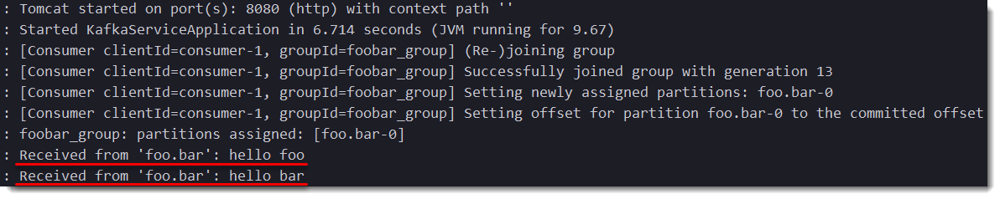
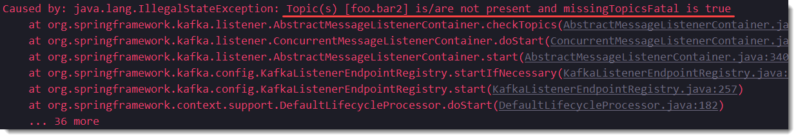

# 01-Spring-Kafka

Spring Boot 整合 Kafka，实现一个简单监听示例。


## 工程结构




## pom.xml

修改 pom.xml，添加依赖

```xml
<dependency>
    <groupId>org.springframework.kafka</groupId>
    <artifactId>spring-kafka</artifactId>
</dependency>
```


## application.yml

在 application.yml 中配置 producer 和 consumer

- bootstrap-servers 配置 broker 的地址
- key-serializer 配置键的序列化方式
- value-serializer 配置值的序列化方式
- key-deserializer 配置键的反序列化方式
- value-deserializer 配置值的反序列化方式

> 键值的序列化和反序列要对应

```yml
spring:
  kafka:
    producer:
      bootstrap-servers: 192.168.1.180:9092
      retries: 1
      batch-size: 16384
      buffer-memory: 1024000
      key-serializer: org.apache.kafka.common.serialization.IntegerSerializer
      value-serializer: org.apache.kafka.common.serialization.StringSerializer
    consumer:
      bootstrap-servers: 192.168.1.180:9092
      group-id: foobar_group
      max-poll-records: 100
      enable-auto-commit: true
      auto-commit-interval: 100
      key-deserializer: org.apache.kafka.common.serialization.IntegerDeserializer
      value-deserializer: org.apache.kafka.common.serialization.StringDeserializer
```


## FoobarListener

监听主题 `foo.bar`

```java
@Slf4j
@Component
public class FoobarListener {

    /**
     * 监听主题名称为 foo.bar
     *
     * @param msg 消费的消息
     */
    @KafkaListener(topics = "foo.bar")
    public void listen(String msg) {
        log.info("Received from 'foo.bar': {}", msg);
    }

}
```


## FoobarListenerTest

- 拿到 application.yml 的配置信息

  ```java
  @Autowired
  private KafkaProperties kafkaProperties;
  ```

- 构建生产者

  ```java
  private KafkaTemplate<Integer, String> kafkaTemplate;
  
  @Before
  public void beforeTest() {
      Map<String, Object> props = kafkaProperties.buildProducerProperties();
      kafkaTemplate = new KafkaTemplate<>(new DefaultKafkaProducerFactory<>(props));
  }
  ```

- 向主题 `foo.bar` 发送消息

  ```java
  @Test
  public void testFoobar() throws InterruptedException, ExecutionException {
      String data = "hello, foobar " + UUID.randomUUID();
      ListenableFuture<SendResult<Integer, String>> future = kafkaTemplate.send("foo.bar", data);
      SendResult<Integer, String> sendResult = future.get();
      Assert.assertEquals(sendResult.getProducerRecord().value(), data);
      // 休眠 5 秒，因为监听器收数据需要时间
      Thread.sleep(5000);
  }
  ```


## 运行结果




## 命令行测试

通过命令行发送消息

```shell
# 进入 Kafka 容器
sudo docker exec -it kafka bash
```




程序运行结果




## 小提示

- 查看主题列表

  ```shell
  # 进入 kafka 容器
  sudo docker exec -it kafka bash
  # 查看 Kafka 主题列表
  kafka-topics.sh --list --zookeeper zookeeper:2181
  ```


- 建议手动创建主题

  使用 KafkaTemplate 发送消息的时候，如果主题不存在，就会自动创建一个。但是，通过 KafkaTemplate 自动创建主题不是一个好的使用方式，因为这样创建出来的主题的分区数永远只有 1 个，也不会有副本（Kafka 集群时使用），影响了后续的扩展。正确的使用方式是通过命令或代码手动创建主题。


- 监听不存在主题异常

  如果监听一个不存在的主题，例如：`@KafkaListener(topics = "foo.bar2")`

  可以通过在 application.yml 配置允许监听不存在的主题：

  ```yml
  spring:
    kafka:
      listener:
        missing-topics-fatal: false
  ```


