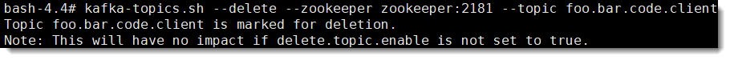

# 02-Spring-Kafka

创建/修改主题


## Kafka Tool

Kafka 可视化客户端工具

http://www.kafkatool.com/download.html


## 查看主题

### 命令方式

```shell
# 进入 kafka 容器
sudo docker exec -it kafka bash
# 查看 Kafka 主题列表
kafka-topics.sh --list --zookeeper zookeeper:2181
# 查看 Kafka 主题描述
kafka-topics.sh --describe --zookeeper zookeeper:2181 --topic foo.bar.code.client
```


### 代码方式

```java
@Test
public void testDescribeTopics() throws ExecutionException, InterruptedException {
    log.info("{}", adminClient.listTopics().namesToListings().get());
    final String topicName = "foo.bar.code.client";
    DescribeTopicsResult result =
            adminClient.describeTopics(Collections.singletonList(topicName));
    log.info("{}", result.all().get());
}
```


## 创建主题

### 命令方式

- replication-factor 副本数
- partitions 分区数
- topic 主题名称

```shell
kafka-topics.sh --create --zookeeper zookeeper:2181 --replication-factor 1 --partitions 5 --topic foo.bar.cmd
```


### 代码方式

- 注解方式

  ```java
  /**
    * 创建/修改主题名称为 foo.bar.code.annotation 的主题，并设置分区数为 5，副本数为 1
    *
    * @return {@link NewTopic} 对象
    */
  @Bean
  public NewTopic initialTopic() {
      return new NewTopic("foo.bar.code.annotation", 5, (short) 1);
  }
  ```


- 手动方式

  需要用到 KafkaAdmin 和 AdminClient

  ```java
  @Bean
  public KafkaAdmin kafkaAdmin() {
      return new KafkaAdmin(kafkaProperties.buildAdminProperties());
  }
  
  @Bean
  public AdminClient adminClient() {
      return AdminClient.create(kafkaAdmin().getConfig());
  }
  ```

  调用示例

  ```java
  @Test
  public void testCreateTopic() throws InterruptedException {
      final String topicName = "foo.bar.code.client";
      if (adminClient.listTopics().names().get().contains(topicName)) {
          log.info("delete topic first");
          adminClient.deleteTopics(Collections.singletonList(topicName))
              .all().get();
      }
      // 代码执行至此，请求删除主题成功，主题可能未被真正删除
      Thread.sleep(1000);
      NewTopic topic = new NewTopic(topicName, 5, (short) 1);
      CreateTopicsResult result =
              adminClient.createTopics(Collections.singletonList(topic));
      result.all().get(); // wait for complete
      Assert.assertTrue(adminClient.listTopics().names().get()
                        .contains(topicName));
  }
  ```


## 修改主题

### 命令方式

```shell
kafka-topics.sh --alter --zookeeper zookeeper:2181 --partitions 7 --topic foo.bar.cmd
```


### 代码方式

- 注解方式

  ```java
  /**
    * 创建主题名称为 foo.bar.code 的主题，并设置分区数为 7，副本数为 1
    *
    * @return 新主题对象
    */
  @Bean
  public NewTopic initialTopic() {
      return new NewTopic("foo.bar.code.annotation", 7, (short) 1);
  }
  ```

- 手动方式

  需要用到 KafkaAdmin 和 AdminClient

  ```java
  @Test
  public void testAlterTopicPartition() throws ExecutionException, InterruptedException {
      final String topicName = "foo.bar.code.client";
      Map<String, NewPartitions> partitions = new HashMap<>();
      partitions.put(topicName, NewPartitions.increaseTo(7));
      CreatePartitionsResult result =
              adminClient.createPartitions(partitions);
      result.all().get(); // wait for complete
      Assert.assertTrue(adminClient.listTopics().names().get()
                        .contains(topicName));
  }
  ```


## 删除主题

```shell
kafka-topics.sh --delete --zookeeper zookeeper:2181 --topic foo.bar.code.client
```



> **说明：**
>
> --delete 执行后，会将该 topic 标记为删除，实际并不执行删除动作。
>
> 注意：如果 delete.topic.enable 未设置为 true，则不会产生任何影响。


