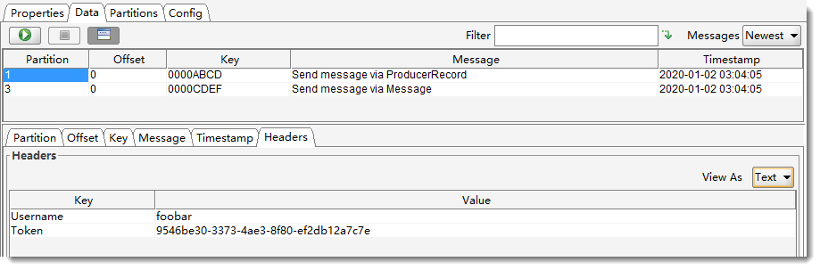
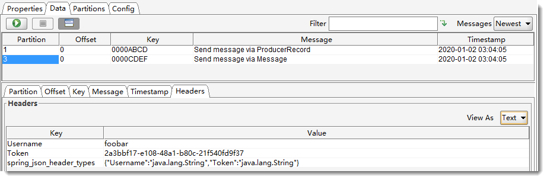

# 03-Spring-Kafka

KafkaTemplate 使用示例


## 生产者

### 发送消息


- **sendDefault** 发送到 KafkaTemplate 的默认主题
- **send** 发送到特定主题

- **参数说明**
  - topic 主题名称
  - partition 分区编号，从 0 开始
  - timestamp 时间戳，一般使用当前时间戳
  - key 消息的键
  - data 消息的值
  - ProducerRecord 消息的封装类，除了包含上述字段外，还有 Headers
  - Message<?> Spring 消息的封装类，包含消息头和消息体


#### sendDefault

使用 sendDefault 需要先设置默认主题

```java
this.kafkaTemplate.setDefaultTopic("foo.bar");
```

- ListenableFuture<SendResult<K, V>> sendDefault(V data);

  发送 data 到默认主题，key 键为 null，不指定分区。

  ```java
  public void sendDefault() throws ExecutionException, InterruptedException {
      // this.kafkaTemplate.setDefaultTopic("foo.bar"); 设置了默认的主题
      // sendDefault 会将消息发送到默认的主题中
      ListenableFuture<SendResult<Integer, String>> future =
          kafkaTemplate.sendDefault("sendDefault " + UUID.randomUUID());
      SendResult<Integer, String> result = future.get();
      ProducerRecord<Integer, String> record = result.getProducerRecord();
      log.info("sendDefault: {}", record);
  }
  ```

- ListenableFuture<SendResult<K, V>> sendDefault(K key, V data);

  发送 key 和 data 到默认主题，不指定分区。

  ```java
  public void sendDefault(Integer key) throws ExecutionException, InterruptedException {
      ListenableFuture<SendResult<Integer, String>> future =
          kafkaTemplate.sendDefault(key, "sendDefault " + UUID.randomUUID());
      SendResult<Integer, String> result = future.get();
      ProducerRecord<Integer, String> record = result.getProducerRecord();
      log.info("sendDefault({}): {}", key, record);
  }
  ```

- ListenableFuture<SendResult<K, V>> sendDefault(Integer partition, K key, V data);

  发送 key 和 data 到默认主题，指定分区。

  ```java
  public void sendDefault(Integer partition, Integer key) throws ExecutionException, InterruptedException {
      // this.kafkaTemplate.setDefaultTopic("foo.bar"); 设置了默认的主题
      // sendDefault 会将消息发送到默认的主题中
      ListenableFuture<SendResult<Integer, String>> future =
          kafkaTemplate.sendDefault(partition, key, "sendDefault " + UUID.randomUUID());
      SendResult<Integer, String> result = future.get();
      ProducerRecord<Integer, String> record = result.getProducerRecord();
      log.info("sendDefault({}, {}): {}", partition, key, record);
  }
  ```
  
- ListenableFuture<SendResult<K, V>> sendDefault(Integer partition, Long timestamp, K key, V data);

  发送 key 和 data 到默认主题，指定分区，指定时间戳。

  ```java
  public void sendDefault(Integer partition, Long timestamp, Integer key) throws ExecutionException, InterruptedException {
      // this.kafkaTemplate.setDefaultTopic("foo.bar"); 设置了默认的主题
      // sendDefault 会将消息发送到默认的主题中
      ListenableFuture<SendResult<Integer, String>> future =
          kafkaTemplate.sendDefault(partition, timestamp, key, "sendDefault " + UUID.randomUUID());
      SendResult<Integer, String> result = future.get();
      ProducerRecord<Integer, String> record = result.getProducerRecord();
      log.info("sendDefault({}, {}, {}): {}", partition, timestamp, key, record);
  }
  ```

- 测试

  ```java
  @Autowired
  private FoobarKafkaTemplate foobarKafkaTemplate;
  
  @Test
  void sendDefault() throws ExecutionException, InterruptedException, ParseException {
      foobarKafkaTemplate.sendDefault();
      foobarKafkaTemplate.sendDefault(0x1234);
      foobarKafkaTemplate.sendDefault(1, 0x5678);
      SimpleDateFormat sdf = new SimpleDateFormat("yyyy-MM-dd'T'HH:mm:ss");
      long time = sdf.parse("2020-01-02T03:04:05").getTime();
      foobarKafkaTemplate.sendDefault(1, time, 0x9999);
  }
  ```

  


#### send

以下 4 个接口，与 sendDefault 的 4 个接口相比，多了 String topic 参数，指定发送的主题。

- ListenableFuture<SendResult<K, V>> send(String topic, V data);
- ListenableFuture<SendResult<K, V>> send(String topic, K key, V data);
- ListenableFuture<SendResult<K, V>> send(String topic, Integer partition, K key, V data);
- ListenableFuture<SendResult<K, V>> send(String topic, Integer partition, Long timestamp, K key, V data);


下面主要介绍两外两个 send 接口

- ListenableFuture<SendResult<K, V>> send(ProducerRecord<K, V> record);

  ProducerRecoed 类的成员变量

  ```java
  private final String topic;
  private final Integer partition;
  private final Headers headers;
  private final K key;
  private final V value;
  private final Long timestamp;
  ```

  ```java
  public void send(ProducerRecord<Integer, String> producerRecord) throws ExecutionException, InterruptedException {
      ListenableFuture<SendResult<Integer, String>> future = kafkaTemplate.send(producerRecord);
      SendResult<Integer, String> result = future.get();
      ProducerRecord<Integer, String> record = result.getProducerRecord();
      log.info("{}", record);
  }
  ```

- ListenableFuture<SendResult<K, V>> send(Message<?> message);

  Message<?> 接口定义

  ```java
  public interface Message<T> {
      T getPayload();
      MessageHeaders getHeaders();
  }
  ```

  ```java
  public void send(Message<String> message) throws ExecutionException, InterruptedException {
      ListenableFuture<SendResult<Integer, String>> future = kafkaTemplate.send(message);
      SendResult<Integer, String> result = future.get();
      ProducerRecord<Integer, String> record = result.getProducerRecord();
      log.info("{}", record);
  }
  ```

- 测试

  ```java
  @Test
  void send() throws ExecutionException, InterruptedException, ParseException {
      // 通过 ProducerRecord 发送消息
      SimpleDateFormat sdf = new SimpleDateFormat("yyyy-MM-dd'T'HH:mm:ss");
      long time = sdf.parse("2020-01-02T03:04:05").getTime();
      List<Header> headers = new ArrayList<>();
      headers.add(new RecordHeader("Username", "foobar".getBytes()));
      headers.add(new RecordHeader("Token", UUID.randomUUID().toString().getBytes()));
      ProducerRecord<Integer, String> record = new ProducerRecord<>(
          "foo.bar.code", 1, time, 0xABCD,
          "Send message via ProducerRecord", headers);
      foobarKafkaTemplate.send(record);
  
      // 通过 Message<?> 发送消息
      Map<String, Object> map = new HashMap<>();
      map.put(KafkaHeaders.TOPIC, "foo.bar.code");
      map.put(KafkaHeaders.PARTITION_ID, 3);
      map.put(KafkaHeaders.TIMESTAMP, time);
      map.put(KafkaHeaders.MESSAGE_KEY, 0xCDEF);
      map.put("Username", "foobar");
      map.put("Token", UUID.randomUUID().toString());
      GenericMessage<String> message = new GenericMessage<>(
          "Send message via Message", new MessageHeaders(map));
      foobarKafkaTemplate.send(message);
  }
  ```

  

  

  > **注意：**
  >
  > 在测试代码中，给 Header 添加了 Username 和 Token 只是一个示例，并不是建议大家这么做。


### 事务

#### 事务配置

- **生成者：**
  - 配置 transactional.id 属性
  - 设置幂等性 enable.idempotence 为 true

- **消费者：**
  - 设置自动提交 enable.auto.commit 为 false
  - 代码中不能使用手动提交 commitSync( ) 或 commitAsync( )
  - 设置隔离级别 isolation.level 为 read_committed


```java
@Bean
public ProducerFactory<Integer, String> producerFactory() {
    DefaultKafkaProducerFactory<Integer, String> factory =
        new DefaultKafkaProducerFactory<>(kafkaProperties.buildProducerProperties());
    factory.setTransactionIdPrefix("tx"); // 设置事务前缀，表示开启事务支持
    return factory;
}

@Bean
public KafkaTemplate<Integer, String> kafkaTemplate(
    @Autowired ProducerFactory<Integer, String> producerFactory) {
    KafkaTemplate<Integer, String> kafkaTemplate = new KafkaTemplate<>(producerFactory);
    kafkaTemplate.setDefaultTopic("foo.bar");
    kafkaTemplate.setProducerListener(new FoobarProducerListener());
    return kafkaTemplate;
}

// Kafka 事务管理器，使用 @Transactional 注解时用到
@Bean
public KafkaTransactionManager<Integer, String> transactionManager(
    @Autowired ProducerFactory<Integer, String> producerFactory) {
    return new KafkaTransactionManager<>(producerFactory);
}
```


#### executeInTransaction

可以 KafkaTemplate 的 executeInTransaction 方法实现事务。

```java
public void executeInTransaction(boolean abort) throws ExecutionException, InterruptedException {
    ListenableFuture<SendResult<Integer, String>> future = kafkaTemplate.executeInTransaction(operations -> {
        ListenableFuture<SendResult<Integer, String>> f =
            operations.sendDefault("Send message in executeInTransaction");
        if (abort) {
            throw new RuntimeException("make some noise");
        }
        return f;
    });
    SendResult<Integer, String> result = future.get();
    ProducerRecord<Integer, String> record = result.getProducerRecord();
    log.info("{}", record);
}
```


#### @Transactional

使用 Spring 提供的注解实现事务。

```java
@Transactional
public void atTransactional() {
    kafkaTemplate.sendDefault("Send message in @Transactional");
    throw new RuntimeException("make some noise");
}
```


### 发送消息的结果

发送成功，不代表消息就会被立即消费。


#### 监听器

KafkaTemplate 的 sendDefault 和 send 都是异步的，可以通过 setProducerListener 设置 ProducerListener<K, V> 来监听发送结果。

```java
this.kafkaTemplate.setProducerListener(new FoobarProducerListener());
```


```java
package eniso.kafka;

import lombok.extern.slf4j.Slf4j;
import org.apache.kafka.clients.producer.ProducerRecord;
import org.apache.kafka.clients.producer.RecordMetadata;
import org.springframework.kafka.support.ProducerListener;

@Slf4j
public class FoobarProducerListener implements ProducerListener<Integer, String> {

    @Override
    public void onSuccess(ProducerRecord<Integer, String> producerRecord, RecordMetadata recordMetadata) {
        log.info("{}", producerRecord);
        log.info("{}", recordMetadata);
    }

    @Override
    public void onError(ProducerRecord<Integer, String> producerRecord, Exception exception) {
        log.info("{}", producerRecord);
        log.info(exception.getMessage(), exception);
    }

}
```


#### 阻塞等待

KafkaTemplate 的 sendDefault 和 send 都是异步的，除了可以通过设置监听器来接收发送结果之外，还可以通过 get() 方法阻塞等待结果。例如：

```java
public void send(ProducerRecord<Integer, String> producerRecord) throws ExecutionException, InterruptedException {
    ListenableFuture<SendResult<Integer, String>> future = kafkaTemplate.send(producerRecord);
    SendResult<Integer, String> result = future.get();
    ProducerRecord<Integer, String> record = result.getProducerRecord();
    log.info("{}", record);
}
```


## 消费者

### 直接监听

```java
@Bean
public ConsumerFactory<Integer, String> consumerFactory() {
    // 构建消费者工厂
    return new DefaultKafkaConsumerFactory<>(kafkaProperties.buildConsumerProperties());
}

@Bean
public KafkaMessageListenerContainer<Integer, String> messageListenerContainer(
    @Autowired ConsumerFactory<Integer, String> consumerFactory) {
    ContainerProperties properties = new ContainerProperties("foo.bar.cmd");
    properties.setGroupId("at_bean");
    properties.setMessageListener((MessageListener<Integer, String>) record ->
            log.info("foo.bar.cmd @Bean received: {}", record));
    return new KafkaMessageListenerContainer<>(consumerFactory, properties);
}
```

测试

```shell
bash-4.4# kafka-console-producer.sh --broker-list localhost:9092 --topic foo.bar.cmd
>hello
```


### 通过 @KafkaListener 监听

最简单的使用方式

```java
@KafkaListener(topics = "foo.bar")
public void listen(String msg) {
    log.info("Received from 'foo.bar': {}", msg);
}
```


@KafkaListener 标注的方法，可能包含的参数：

- data

  data 为普通数据类型时，用作单条数据消费

  **data instanceof List** 用作批量数据消费

  **data instanceof ConsumerRecord** 消费者记录类，包含 Headers 信息、分区信息、时间戳等额外数据

- Acknowledgment

  需要用到 Ack 机制时使用

- Consumer

  消费者类，可以实现手动提交偏移量、控制消费速率等


**GenericMessageListener** 接口的继承关系


其中，前缀为 **Batch** 的接口，为批量处理消息的接口。可以从泛型 **List<ConsumerRecord<K, V>** 看出。

使用批量处理消息接口时，指定监听容器工厂可以设置合理的并发数，启动程序后，可以通过控制台日志，关键打印 Setting newly assigned partitions 查看监听线程与分区的关系。

> **注意：**
>
> setConcurrency 并发量不应大于分区数，适量增加分区数量可以提高吞吐量。

```java
/**
 * 监听容器工厂（批量）
 *
 * @param consumerFactory {@link ConsumerFactory} 消费者工厂
 * @return {@link ConcurrentKafkaListenerContainerFactory}
 */
@Bean("batchListenerContainerFactory")
public ConcurrentKafkaListenerContainerFactory<Integer, String> batchListenerContainerFactory(
    @Autowired ConsumerFactory<Integer, String> consumerFactory) {
    ConcurrentKafkaListenerContainerFactory<Integer, String> factory =
        new ConcurrentKafkaListenerContainerFactory<>();
    factory.setConsumerFactory(consumerFactory);
    // 设置并发量，小于或等于 Topic 的分区数
    factory.setConcurrency(5);
    // 设置为批量监听
    factory.setBatchListener(true);
    return factory;
}
```


#### @KafkaListener 接口

```java
public @interface KafkaListener {

    /**
     * 管理此端点的容器的唯一标识符。
     * 如果未指定，则提供自动生成的一个。
     * 提供时，此值将覆盖在 ConsumerFactory 中配置的组 ID 属性，除非 #idIsGroup 设置为 false。
     * 支持 SpEL 表达式 #{...} 和 ${...}
     */
	String id() default "";

    /**
     * KafkaListenerContainerFactory 的 bean 名称，用于创建负责服务于此端点的消息侦听器容器。
     * 如果未指定，则使用默认容器工厂（如果有）。
     */
	String containerFactory() default "";

	/**
	 * 此侦听器的主题集合。
	 * 这些条目可以是主题名称，属性占位键 ${...} 或表达式 #{...}。
	 * 与 #topicPattern 和 #topicPartitions 互斥。
	 */
	String[] topics() default {};

	/**
	 * 此侦听器的主题正则表达式。这些条目可以是“主题正则表达式”，“属性占位键”或“表达式”。
	 * 该框架将创建一个容器，该容器订阅与指定正则表达式匹配的所有主题，以获取动态分配的分区。 
	 * 正则匹配将针对检查时存在的主题定期执行。表达式必须解析为主题正则（支持字符串或模式结果类型）。
	 * 这使用了组管理，Kafka 会将分区分配给组成员。
	 * 与 #topics 和 #topicPartitions 互斥。
	 */
	String topicPattern() default "";

	/**
	 * The topicPartitions for this listener when using manual topic/partition
	 * assignment.
	 * <p>
	 * Mutually exclusive with {@link #topicPattern()} and {@link #topics()}.
	 * @return the topic names or expressions (SpEL) to listen to.
	 */
	TopicPartition[] topicPartitions() default {};

	/**
	 * If provided, the listener container for this listener will be added to a bean
	 * with this value as its name, of type {@code Collection<MessageListenerContainer>}.
	 * This allows, for example, iteration over the collection to start/stop a subset
	 * of containers.
	 * <p>SpEL {@code #{...}} and property place holders {@code ${...}} are supported.
	 * @return the bean name for the group.
	 */
	String containerGroup() default "";

	/**
	 * Set an {@link org.springframework.kafka.listener.KafkaListenerErrorHandler} bean
	 * name to invoke if the listener method throws an exception.
	 * @return the error handler.
	 * @since 1.3
	 */
	String errorHandler() default "";

	/**
	 * Override the {@code group.id} property for the consumer factory with this value
	 * for this listener only.
	 * <p>SpEL {@code #{...}} and property place holders {@code ${...}} are supported.
	 * @return the group id.
	 * @since 1.3
	 */
	String groupId() default "";

	/**
	 * When {@link #groupId() groupId} is not provided, use the {@link #id() id} (if
	 * provided) as the {@code group.id} property for the consumer. Set to false, to use
	 * the {@code group.id} from the consumer factory.
	 * @return false to disable.
	 * @since 1.3
	 */
	boolean idIsGroup() default true;

	/**
	 * When provided, overrides the client id property in the consumer factory
	 * configuration. A suffix ('-n') is added for each container instance to ensure
	 * uniqueness when concurrency is used.
	 * <p>SpEL {@code #{...}} and property place holders {@code ${...}} are supported.
	 * @return the client id prefix.
	 * @since 2.1.1
	 */
	String clientIdPrefix() default "";

	/**
	 * A pseudo bean name used in SpEL expressions within this annotation to reference
	 * the current bean within which this listener is defined. This allows access to
	 * properties and methods within the enclosing bean.
	 * Default '__listener'.
	 * <p>
	 * Example: {@code topics = "#{__listener.topicList}"}.
	 * @return the pseudo bean name.
	 * @since 2.1.2
	 */
	String beanRef() default "__listener";

	/**
	 * Override the container factory's {@code concurrency} setting for this listener. May
	 * be a property placeholder or SpEL expression that evaluates to a {@link Number}, in
	 * which case {@link Number#intValue()} is used to obtain the value.
	 * <p>SpEL {@code #{...}} and property place holders {@code ${...}} are supported.
	 * @return the concurrency.
	 * @since 2.2
	 */
	String concurrency() default "";

	/**
	 * Set to true or false, to override the default setting in the container factory. May
	 * be a property placeholder or SpEL expression that evaluates to a {@link Boolean} or
	 * a {@link String}, in which case the {@link Boolean#parseBoolean(String)} is used to
	 * obtain the value.
	 * <p>SpEL {@code #{...}} and property place holders {@code ${...}} are supported.
	 * @return true to auto start, false to not auto start.
	 * @since 2.2
	 */
	String autoStartup() default "";

	/**
	 * Kafka consumer properties; they will supersede any properties with the same name
	 * defined in the consumer factory (if the consumer factory supports property overrides).
	 * <h3>Supported Syntax</h3>
	 * <p>The supported syntax for key-value pairs is the same as the
	 * syntax defined for entries in a Java
	 * {@linkplain java.util.Properties#load(java.io.Reader) properties file}:
	 * <ul>
	 * <li>{@code key=value}</li>
	 * <li>{@code key:value}</li>
	 * <li>{@code key value}</li>
	 * </ul>
	 * {@code group.id} and {@code client.id} are ignored.
	 * @return the properties.
	 * @since 2.2.4
	 * @see org.apache.kafka.clients.consumer.ConsumerConfig
	 * @see #groupId()
	 * @see #clientIdPrefix()
	 */
	String[] properties() default {};

	/**
	 * 如果为 false 且返回类型为 {@link Iterable}，
	 * 则返回结果作为单个回复记录的值，而不是每个元素的单独记录的值。
	 * 默认为true。是否忽略回复类型为 {@code Iterable <Message<?>>}。
	 * @return 如果为 false，则创建单个回复记录。
	 * @since 2.3.5
	 */
	boolean splitIterables() default true;

}
```


#### 简单示例

```java
/**
 * 监听主题名称为 foo.bar
 *
 * @param msg 消费的消息
 */
@KafkaListener(topics = "foo.bar",
               containerFactory = "listenerContainerFactory",
               errorHandler = "consumerAwareErrorHandler")
public void listenMessage(String msg) {
    log.info("Received from 'foo.bar': {}", msg);
    if ("error".equals(msg)) {
        throw new RuntimeException("make some noise");
    }
}
```


#### 通过 ConsumerRecord 接收消息

```java
/**
 * 使用 {@link ConsumerRecord} 消费者记录类，包含 Headers 信息、分区信息、时间戳等额外数据
 *
 * @param records 消费者记录集合
 */
@KafkaListener(topics = "foo.bar.cmd",
               containerFactory = "batchListenerContainerFactory",
               errorHandler = "consumerAwareErrorHandler")
public void listenConsumerRecord(List<ConsumerRecord<Integer, String>> records) {
    log.info("Received batch from 'foo.bar.cmd': {}", records);
}
```


#### 指定分区消费（可能很少使用）

```java
/**
 * 指定分区消费（可能很少使用）
 *
 * @param records 消费者记录集合
 */
@KafkaListener(groupId = "bbb", clientIdPrefix = "bwp",
               containerFactory = "batchListenerContainerFactory",
               topicPartitions = {
                   @TopicPartition(topic = "foo.bar.cmd", partitions = {"1", "2"}),
                   @TopicPartition(topic = "foo.bar.cmd", partitions = {"0"}/*,
                            partitionOffsets = @PartitionOffset(partition = "3", initialOffset = "1")*/
                                  )
               }
              )
public void listenConsumerRecordWithPartition(List<ConsumerRecord<Integer, String>> records) {
    log.info("Received batch from 'foo.bar.cmd': {}", records);
}
```


#### 通过注解的方式获取消息头及消息体

```java
/**
 * 注解方式获取消息头及消息体
 *
 * @param msg         消息体
 * @param topic       主题
 * @param partitionId 分区编号
 * @param timestamp   时间戳
 */
@KafkaListener(id = "header-example", topics = "foo.bar.cmd")
public void listenMessageWithHeaders(
    @Payload String msg,
    @Header(KafkaHeaders.RECEIVED_TOPIC) String topic,
    @Header(KafkaHeaders.RECEIVED_PARTITION_ID) int partitionId,
    @Header(KafkaHeaders.RECEIVED_TIMESTAMP) long timestamp) {
    log.info("Received from 'foo.bar.cmd': msg={}, topic={}, partitionId={}, timestamp={}", msg, topic, partitionId, timestamp);
}
```


#### 通过 ACK 机制接收消息

Kafka 是通过最新保存偏移量进行消息消费的，确认消费的消息并不会立刻删除，所以我们可以重复消费未被删除的数据。当较早的消息未被确认，而较晚的消息被确认的时候，Kafka 会保存较晚的消息的偏移量，也就是说较早的消息再也不会被监听器所获取，除非是根据消息的偏移量手动获取。

**使用 ACK 机制需要配置：**

- 设置自动提交 enable.auto.commit 为 false
- 设置 AckMode = MANUAL_IMMEDIATE
- 监听方法加入 Acknowledgment 类参数


**设置自动提交 enable.auto.commit 为 false**

为了代码的兼容，建议的使用方式：

- 配置文件中，禁用自动提交

  ```yml
  spring:
    kafka:
      consumer:
        enable-auto-commit: false
  ```

- 构建消费者工厂时，根据实际情况，添加/修改属性

  ```java
  @Bean("consumerFactoryDisableAutoCommit")
  public ConsumerFactory<Integer, String> consumerFactoryDisableAutoCommit() {
      Map<String, Object> props = kafkaProperties.buildConsumerProperties();
      // 建议在这里开启/禁用自动提交
      props.put(ConsumerConfig.ENABLE_AUTO_COMMIT_CONFIG, false);
      return new DefaultKafkaConsumerFactory<>(props);
  }
  ```


**设置 AckMode = MANUAL_IMMEDIATE**

> **温馨提示：**
>
> 通过 SpringBoot 配置也可以实现（个人建议使用代码方式）
>
> ```yml
> spring:
>   kafka:
>     listener:
>       ack-mode: manual_immediate
> ```

```java
/**
 * ACK 机制监听容器工厂
 *
 * @param consumerFactoryDisableAutoCommit {@link ConsumerFactory} 消费者工厂
 * @return {@link ConcurrentKafkaListenerContainerFactory}
 */
@Bean("ackListenerContainerFactory")
public ConcurrentKafkaListenerContainerFactory<Integer, String> ackListenerContainerFactory(
        @Autowired ConsumerFactory<Integer, String> consumerFactoryDisableAutoCommit) {
    ConcurrentKafkaListenerContainerFactory<Integer, String> factory =
        new ConcurrentKafkaListenerContainerFactory<>();
    factory.setConsumerFactory(consumerFactoryDisableAutoCommit);
    factory.getContainerProperties().setAckOnError(false);
    factory.getContainerProperties().setAckMode(
        ContainerProperties.AckMode.MANUAL_IMMEDIATE);
    return factory;
}
```


**监听方法加入 Acknowledgment 类参数**

```java
/**
 * ACK 机制的消息监听
 *
 * @param record 消费的消息
 * @param ack    {@link Acknowledgment} 对象
 */
@KafkaListener(id = "ack-example",
               groupId = "ack-example",
               topics = "foo.bar.ack.cmd",
               containerFactory = "ackListenerContainerFactory")
public void ackListenerMessage(ConsumerRecord<Integer, String> record,
                               Acknowledgment ack) {
    log.info("Received with ack from 'foo.bar.ack.cmd': {}", record);
    // 如果不调用 ack.acknowledge()，表示拒绝次消息
    ack.acknowledge();
}
```


> **温馨提示**
>
> 如果拒绝本次消息，而又希望后面可以重复消费这次的消息，可以这么做：
>
> **方法一：**不调用 `ack.acknowledge();`，调用 `kafkaTemplate.send("foo.bar.ack.cmd", record.value());` 将本次消息再次发到主题中去。这种方式，可以在 Headers 上添加一些参数，记录第几次消费了次消息。
>
> **方法二：**使用 Consumer.seek 方法，即 `consumer.seek(new TopicPartition("foo.bar.ack.cmd", record.partition()), record.offset());`，指定消息偏移量的位置进行消费。此方法可能会导致死循环，需要避免重复 seek 在一个无法处理的消息上。


### 异常处理

Spring-Kafka 的 @KafkaListener 监听主题消息，并进行业务逻辑处理，而 @KafkaListener 抛出的异常交给 ConsumerAwareErrorHandler 处理。

示例：

```java
@Bean
public ConsumerAwareListenerErrorHandler consumerAwareErrorHandler() {
    return (message, exception, consumer) -> {
        log.info("consumerAwareErrorHandler: {}", message.getPayload().toString());

        MessageHeaders headers = message.getHeaders();
        for (String key : headers.keySet()) {
            log.info("k:{}, v:{}", key, headers.get(key));
            // 注意：批量时，value 的类型是 List<?>
        }

        return null;
    };
}
```


