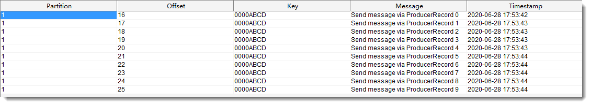

# 04-Spring-Kafka

分区器、过滤器、定时启动


## 分区器

> 分区器（Partitioner）和分区分配策略（Partition Assignment Strategy）是不同的：
>
> 分区器用于生产者确定把消息发往哪个分区；
>
> 分区分配策略用于确定消费组中的消费者消费哪些分区。

### 默认的分区器

- 键值为 null，默认分区器使用轮询（Round Robin）算法将消息均衡地分布到各个分区上。
- 键值不为空，默认分区器使用 hash(key) % numPartitions 算法把消息映射到特定的分区上，同一个键值总是被映射到同一个分区上。

### 自定义分区器

- 实现 Partitioner 接口

  ```java
  public class KafkaPartitioner implements Partitioner {
  
      @Override
      public int partition(String topic, Object key, byte[] keyBytes, Object value, byte[] valueBytes, Cluster cluster) {
          // 算法根据实际情况实现，例如：一致性哈希算法
          // 例如就只给分区 1 发消息
          return 1;
      }
  
      @Override
      public void close() {
      }
  
      @Override
      public void configure(Map<String, ?> configs) {
      }
  
  }
  ```

- 指定生产者的分区器

  ```java
  @Bean
  public ProducerFactory<Integer, String> producerFactory() {
      Map<String, Object> props = kafkaProperties.buildProducerProperties();
      // 指定分区器
      props.put(ProducerConfig.PARTITIONER_CLASS_CONFIG,
                KafkaPartitioner.class.getName());
      return new DefaultKafkaProducerFactory<>(props);
  }
  ```

- 测试代码

  ```java
  @Test
  void sendPartitioner() throws ExecutionException, InterruptedException {
      for (int i = 0; i < 10; i++) {
          ProducerRecord<Integer, String> record = new ProducerRecord<>(
              "foo.bar.cmd", null, System.currentTimeMillis(), 0xABCD,
              "Send message via ProducerRecord " + i);
          foobarKafkaTemplate.send(record);
          Thread.sleep(100);
      }
      Thread.sleep(5000);
  }
  ```

- 结果

  


## 过滤器

消息过滤器可以在消息抵达监听容器前被拦截，过滤器根据系统业务逻辑去筛选出需要的数据再交由 KafkaListener 处理。

配置消息其实是非常简单的额，只需要为监听容器工厂配置一个RecordFilterStrategy(消息过滤策略)，返回true的时候消息将会被抛弃，返回false时，消息能正常抵达监听容器。


示例：过滤掉以 ignore 开头的消息

```java
/**
 * 监听容器工厂
 *
 * @param consumerFactory {@link ConsumerFactory} 消费者工厂
 * @return {@link ConcurrentKafkaListenerContainerFactory}
 */
@Bean
public ConcurrentKafkaListenerContainerFactory<Integer, String> listenerContainerFactory(
        @Autowired ConsumerFactory<Integer, String> consumerFactory) {
    ConcurrentKafkaListenerContainerFactory<Integer, String> factory =
        new ConcurrentKafkaListenerContainerFactory<>();
    factory.setConsumerFactory(consumerFactory);
    factory.setAckDiscarded(true); // 回复丢弃
    factory.setRecordFilterStrategy(record -> {
        String msg = record.value();
        log.info("msg={}", msg);
        // 返回 true 表示不再交给监听器消费，即丢弃
        return msg != null && msg.startsWith("ignore");
    });
    return factory;
}

```


结果：只有一条 Received from 'foo.bar.cmd'

```
msg=Send message via ProducerRecord
Received from 'foo.bar.cmd': Send message via ProducerRecord
msg=ignore Send message via ProducerRecord
```


## 定时启动

- 前提知识

@KafkaListener 注解所标注的方法并没有在 IOC 容器中注册为 Bean，而是会被注册在 KafkaListenerEndpointRegistry 中，KafkaListenerEndpointRegistry 在 SpringIOC 中已经被注册为 Bean（不是使用注解方式注册）。

```java
public class KafkaListenerEndpointRegistry implements DisposableBean, SmartLifecycle, ApplicationContextAware,
		ApplicationListener<ContextRefreshedEvent> {
	protected final LogAccessor logger = new LogAccessor(LogFactory.getLog(getClass()));
	private final Map<String, MessageListenerContainer> listenerContainers = new ConcurrentHashMap<>();
......
}
```


- 定时启动/停止（autoStartup = "false"）

```java
@Slf4j
@Component
@EnableScheduling
public class TaskFoobarListener {

    private final KafkaListenerEndpointRegistry registry;

    @Autowired
    public TaskFoobarListener(KafkaListenerEndpointRegistry registry) {
        this.registry = registry;
    }

    @KafkaListener(id = "task-example",
            topics = "foo.bar.cmd",
            autoStartup = "false",
            containerFactory = "listenerContainerFactory")
    public void durableListener(String msg) {
        log.info("Received (task) from 'foo.bar.cmd': {}", msg);
    }

    // 定时器，每天早上 2 点开启监听
    @Scheduled(cron = "0 0 2 * * ?")
    public void startListener() {
        if (!registry.getListenerContainer("task-example").isRunning()) {
            registry.getListenerContainer("task-example").start();
        }
        registry.getListenerContainer("task-example").resume();
    }

    // 定时器，每天早上 8 点关闭监听
    @Scheduled(cron = "0 0 8 * * ?")
    public void shutDownListener() {
        registry.getListenerContainer("task-example").pause();
    }

}
```


更多参考：https://docs.spring.io/spring-kafka/reference/html/

